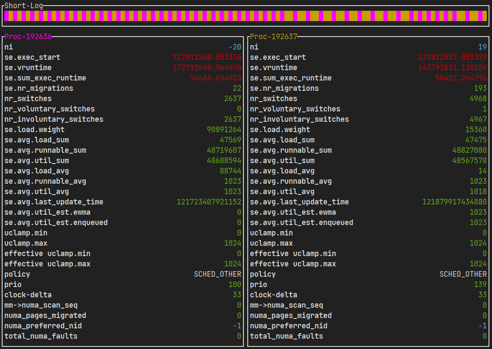

# `testnice`

You will need to `cargo build` this. But if you are on 
`x86_64-unknown-linux-gnu` you can use the provided executable `testnice`. 
Obviously you shouldn't trust some random executable off the internet, but you 
do you.



For this to have a noticeable effect to allow students to view the scheduler
churning away in real-time, you will need to flood your CPU with garbage work. 
You can do this with 

```
sudo testnice flood <numthreads> --ni=-20
```

Doing a number that is too high for `--flood` will just freeze your PC. Don't 
do more than the number of cores you have as a start. Actually what's quite 
fun is to freeze your PC and then point out that it will slowly come back to 
use because of the way `vruntime` accumulates!

## System Requirements

You must be running on a valid **Linux** distribution (this is a demonstration
of linux-specific scheduling after all).

You will also need to install the following libraries which you probably 
already have. 

- [`ncurses`](https://github.com/gyscos/cursive/wiki/Install-ncurses)
- `libc`

## Demonstration

This has been considerably updated and now uses a TUI to compare two processes
with different nice levels. 

By default, all `testnice` instances use the same logfile.

1. In a separate terminal

```
sudo testnice flood --thread-count=<THREAD_COUNT>
```

2. Then in the terminal that you are working from 

```
sudo testnice tui --ni1=-20 --ni2=19
```